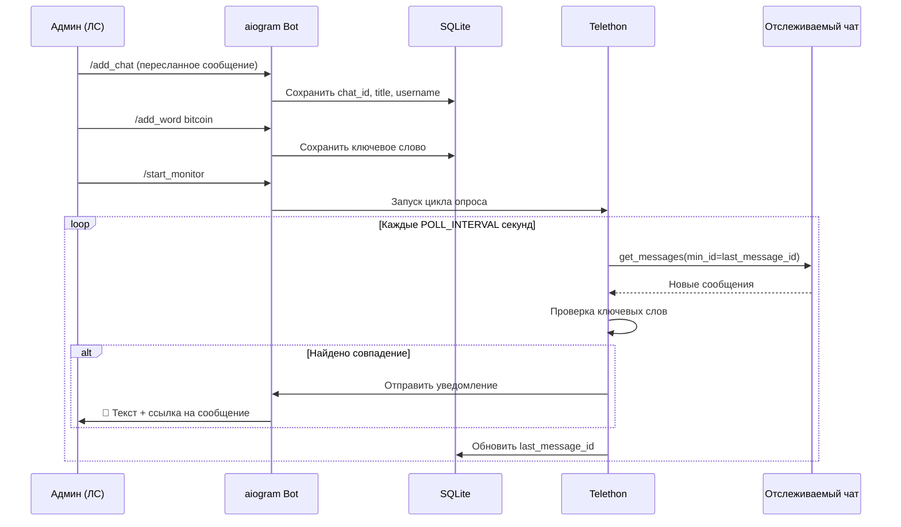

<div align="center">

# 🔭 tg-chat-monitor

**Telegram-бот-наблюдатель за чатами с уведомлениями по ключевым словам**

[](https://www.python.org/)
[](https://docs.aiogram.dev/)
[](https://docs.telethon.dev/)
[](https://www.sqlalchemy.org/)
[](LICENSE)

*Следит за сообщениями в выбранных чатах и мгновенно присылает вам в ЛС ссылку на найденное.*

[Быстрый старт](#-быстрый-старт) •
[Команды](#-команды-бота) •
[Архитектура](#-архитектура) •
[FAQ](#-faq)

</div>

---

## 📖 О проекте

**tg-chat-monitor** — это Python-приложение, которое совмещает два инструмента Telegram API:

| Компонент | Библиотека | Задача |
|-----------|------------|--------|
| 🤖 **Бот** | [aiogram 3.x](https://docs.aiogram.dev/) | Принимает команды в личных сообщениях |
| 👤 **Юзер-клиент** | [Telethon](https://docs.telethon.dev/) | Читает сообщения в отслеживаемых чатах |

Вы добавляете чаты и ключевые слова через бота, запускаете мониторинг — и при появлении совпадения получаете уведомление:

```
🔔 Найдено в чате Крипто-чат: Кто-то написал про bitcoin
Ссылка: https://t.me/crypto_chat/12345
```

### ✨ Возможности

- ➕ Добавление чатов пересылкой любого сообщения из группы/канала
- 🔑 Гибкий список ключевых слов (хранится в SQLite через SQLAlchemy)
- 🔄 Фоновый цикл опроса всех чатов с настраиваемым интервалом
- 🔗 Корректные ссылки на сообщения — и для публичных, и для приватных чатов
- 🔒 Доступ только у одного администратора (`ADMIN_USER_ID`)
- ♻️ Автовосстановление мониторинга после перезапуска

---

## 🏗 Архитектура

<p align="center">
  
</p>



### Как формируются ссылки

| Тип чата | Пример `chat_id` | Формат ссылки |
|----------|------------------|---------------|
| 🌐 Публичный (есть `@username`) | `-1001234567890` | `https://t.me/username/123` |
| 🔒 Приватная супергруппа | `-1001234567890` | `https://t.me/c/1234567890/123` |

> Для приватных чатов из ID убирается префикс `-100`:  
> `-1001234567890` → `1234567890`

---

## 📁 Структура проекта

```
tg-chat-monitor/
├── main.py           # Точка входа
├── bot.py            # Команды aiogram
├── monitor.py        # Цикл мониторинга (Telethon)
├── database.py       # Модели и запросы SQLAlchemy
├── utils.py          # Формирование ссылок, поиск слов
├── config.py         # Загрузка .env
├── requirements.txt
├── .env.example      # Шаблон переменных окружения
└── docs/
    └── assets/
        └── architecture.svg
```

---

## 🚀 Быстрый старт

### Требования

- **Python 3.10+**
- **Telegram-аккаунт** (для Telethon — вы должны быть участником отслеживаемых чатов)
- **Telegram-бот** (токен от [@BotFather](https://t.me/BotFather))
- **API ID и API Hash** с [my.telegram.org](https://my.telegram.org/apps)

### 1. Клонирование

```bash
git clone https://github.com/Hanter1/tg-chat-monitor.git
cd tg-chat-monitor
```

### 2. Виртуальное окружение

```bash
# Windows
python -m venv venv
venv\Scripts\activate

# Linux / macOS
python3 -m venv venv
source venv/bin/activate
```

### 3. Установка зависимостей

```bash
pip install -r requirements.txt
```

### 4. Настройка `.env`

```bash
cp .env.example .env
```

Заполните файл `.env`:

```env
# Токен бота от @BotFather
BOT_TOKEN=123456789:ABCdefGHIjklMNOpqrsTUVwxyz

# API credentials с https://my.telegram.org/apps
API_ID=12345678
API_HASH=your_api_hash_here

# Имя файла сессии Telethon (создаётся автоматически)
TELETHON_SESSION=monitor_session

# Ваш Telegram User ID — узнать: @userinfobot
ADMIN_USER_ID=123456789

# База данных SQLite
DATABASE_URL=sqlite+aiosqlite:///./monitor.db

# Интервал опроса чатов в секундах
POLL_INTERVAL=10
```

#### 🔑 Где взять credentials?

<p align="center">
  
  <br/>
  <sub>Создание бота через <a href="https://t.me/BotFather">@BotFather</a> → команда <code>/newbot</code></sub>
</p>

| Переменная | Где получить |
|------------|--------------|
| `BOT_TOKEN` | [@BotFather](https://t.me/BotFather) → `/newbot` |
| `API_ID`, `API_HASH` | [my.telegram.org/apps](https://my.telegram.org/apps) |
| `ADMIN_USER_ID` | [@userinfobot](https://t.me/userinfobot) или [@getidsbot](https://t.me/getidsbot) |

### 5. Первый запуск

```bash
python main.py
```

При первом запуске Telethon запросит авторизацию вашего аккаунта:

```
Введите номер телефона Telethon (международный формат, +7...): +79001234567
Введите код из Telegram: 12345
```

> Если включена 2FA — программа дополнительно запросит пароль.

После авторизации создаётся файл сессии (`monitor_session.session`) — **не публикуйте его в Git!**

### 6. Настройка через бота

1. Найдите своего бота в Telegram и нажмите **Start** (`/start`)
2. Добавьте чат — перешлите боту любое сообщение из целевой группы:

<p align="center">
  
  <br/>
  <sub>Перешлите сообщение из чата и отправьте <code>/add_chat</code></sub>
</p>

3. Добавьте ключевые слова:

```
/add_word bitcoin
/add_word ethereum
```

4. Запустите мониторинг:

```
/start_monitor
```

---

## 🤖 Команды бота

Все команды работают **только в личных сообщениях** с ботом и **только для администратора**.

| Команда | Описание | Пример |
|---------|----------|--------|
| `/start` | Список команд | `/start` |
| `/add_chat` | Добавить чат (переслать сообщение) | Переслать + `/add_chat` |
| `/add_word` | Добавить ключевое слово | `/add_word криптовалюта` |
| `/list_chats` | Показать отслеживаемые чаты | `/list_chats` |
| `/list_words` | Показать ключевые слова | `/list_words` |
| `/start_monitor` | Запустить мониторинг | `/start_monitor` |
| `/stop_monitor` | Остановить мониторинг | `/stop_monitor` |

### Пример уведомления

<p align="center">
  
</p>

```
🔔 Найдено в чате Крипто News: Обсуждаем bitcoin и альткоины
Ссылка: https://t.me/c/1234567890/42
```

---

## ⚙️ Переменные окружения

| Переменная | Обязательная | По умолчанию | Описание |
|------------|:------------:|--------------|----------|
| `BOT_TOKEN` | ✅ | — | Токен Telegram-бота |
| `API_ID` | ✅ | — | API ID с my.telegram.org |
| `API_HASH` | ✅ | — | API Hash с my.telegram.org |
| `ADMIN_USER_ID` | ✅ | — | Telegram ID администратора |
| `TELETHON_SESSION` | ❌ | `monitor_session` | Имя файла сессии Telethon |
| `DATABASE_URL` | ❌ | `sqlite+aiosqlite:///./monitor.db` | URL базы данных |
| `POLL_INTERVAL` | ❌ | `10` | Интервал опроса (секунды) |

---

## ⚠️ Важные ограничения

> **Telethon использует ваш личный аккаунт**, а не бота. Вы должны быть **участником** каждого отслеживаемого чата.

- 🤖 **Бот** не может читать чужие группы — для этого нужен **юзер-клиент** (Telethon)
- 📵 Бот API не видит сообщения в группах, если бот туда не добавлен (и даже тогда — с ограничениями)
- 🔐 Файлы `.env` и `*.session` содержат секреты — **никогда не коммитьте их**
- ⏱ Минимальный рекомендуемый `POLL_INTERVAL` — **5 секунд** (чтобы не получить flood-ограничения)
- 📝 Поиск работает только по **тексту сообщений** (подписи к медиа тоже учитываются)

---

## 🛠 Запуск в фоне

### Linux (systemd)

```ini
# /etc/systemd/system/tg-chat-monitor.service
[Unit]
Description=Telegram Chat Monitor
After=network.target

[Service]
Type=simple
User=your_user
WorkingDirectory=/path/to/tg-chat-monitor
ExecStart=/path/to/tg-chat-monitor/venv/bin/python main.py
Restart=always
RestartSec=10

[Install]
WantedBy=multi-user.target
```

```bash
sudo systemctl enable tg-chat-monitor
sudo systemctl start tg-chat-monitor
sudo systemctl status tg-chat-monitor
```

### Windows (фоновый процесс)

```powershell
Start-Process python -ArgumentList "main.py" -WindowStyle Hidden
```

### Docker (пример)

```dockerfile
FROM python:3.12-slim
WORKDIR /app
COPY requirements.txt .
RUN pip install --no-cache-dir -r requirements.txt
COPY . .
CMD ["python", "main.py"]
```

> Для Docker потребуется предварительно авторизовать Telethon-сессию и смонтировать файл `*.session` как volume.

---

## ❓ FAQ

<details>
<summary><b>Почему два API — aiogram и Telethon?</b></summary>

Telegram Bot API (aiogram) удобен для команд, но **не может** читать произвольные групповые чаты от имени пользователя.  
Telegram Client API (Telethon) работает как обычный клиент — видит все чаты, в которых состоит ваш аккаунт.
</details>

<details>
<summary><b>Бот не отвечает на команды</b></summary>

1. Проверьте, что `ADMIN_USER_ID` — это **ваш** User ID (не username)
2. Убедитесь, что вы пишете боту в **личные сообщения**, а не в группу
3. Нажмите `/start` в чате с ботом
</details>

<details>
<summary><b>Мониторинг запущен, но уведомлений нет</b></summary>

1. Ваш Telethon-аккаунт состоит в отслеживаемом чате?
2. Ключевые слова добавлены (`/list_words`)?
3. Сообщения содержат текст (не только стикеры/фото без подписи)?
4. Проверьте логи в консоли — там будут ошибки при проблемах с доступом
</details>

<details>
<summary><b>Как добавить чат, если пересылка запрещена?</b></summary>

Если в чате запрещена пересылка, добавьте бота в группу временно или используйте ID чата, полученный через Telethon-утилиты. В текущей версии основной способ — пересылка сообщения.
</details>

<details>
<summary><b>Можно ли отслеживать несколько админов?</b></summary>

В текущей версии — один `ADMIN_USER_ID`. Для нескольких админов потребуется доработка `bot.py` и `config.py`.
</details>

---

## 🤝 Вклад в проект

1. Сделайте Fork репозитория
2. Создайте ветку: `git checkout -b feature/my-feature`
3. Закоммитьте изменения: `git commit -m "Add my feature"`
4. Отправьте Pull Request

---

## 📄 Лицензия

MIT License — используйте свободно, на свой страх и риск.

---

<div align="center">

**Сделано с ❤️ для мониторинга Telegram-чатов**

⭐ Поставьте звезду, если проект был полезен!

</div>
